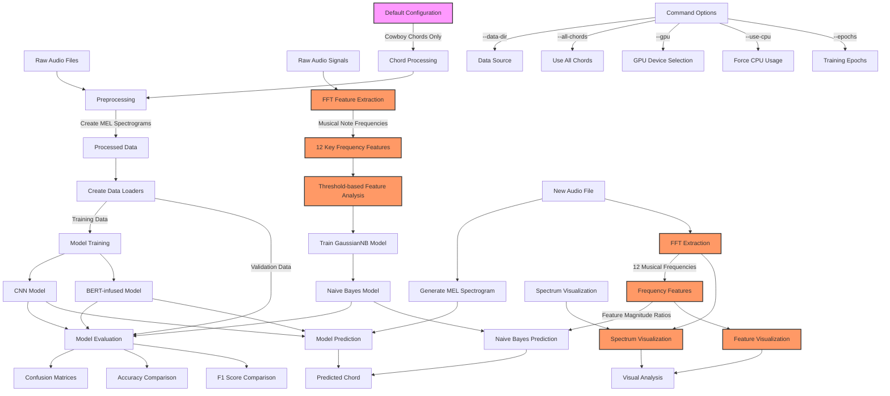

## GuitarSet Chord Recognition Updated Workflow

### Key Components

1. **Preprocessing & Data Loading**:
   - Process raw audio files into MEL spectrograms
   - Create data loaders for training and validation

2. **Model Training**:
   - **CNN Model**: Processes MEL spectrograms directly
   - **BERT Model**: Uses self-attention mechanism after CNN feature extraction
   - **Naive Bayes Model (Updated)**: 
     - Uses FFT to analyze frequency content of audio
     - Extracts 12 features based on musical note frequencies (C through B)
     - Applies threshold-based feature extraction (signal/noise ratio)
     - Trains a Gaussian Naive Bayes classifier on these musical features

3. **Model Evaluation**:
   - Generate confusion matrices for all models
   - Compare accuracy and F1 scores
   - Analyze model strengths and weaknesses

4. **Prediction**:
   - For CNN & BERT: Convert audio to MEL spectrogram
   - For Naive Bayes: Extract frequency features from audio signal
   - Combine predictions from all models

5. **Visualization**:
   - Analyze frequency spectrum with key musical notes marked
   - Visualize feature extraction process
   - Compare feature importance for chord recognition

### Updated Naive Bayes Process

The key improvement is the new feature extraction process:

1. **FFT Analysis**: Apply Fast Fourier Transform to audio signal
2. **Key Frequency Detection**: Extract magnitude at 12 musical note frequencies
3. **Threshold Analysis**: Compare magnitude to noise threshold (15x mean)
4. **Feature Generation**: Create feature vector of amplitude ratios
5. **Classification**: Train Gaussian Naive Bayes on these musical features

This approach better aligns with musical theory by focusing directly on the frequencies that define musical notes, which should improve chord recognition accuracy.
